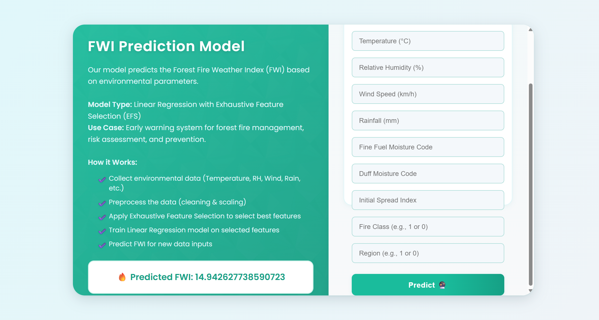

# Algerian Forest Fires FWI Prediction App



This web application predicts the Forest Fire Weather Index (FWI) for Algerian forests using environmental parameters. It is built with Flask and uses a machine learning pipeline (feature scaling, feature selection, and Lasso regression) to provide accurate FWI predictions.

---

## Table of Contents

- [Features](#features)
- [How It Works](#how-it-works)
- [How to Build the Model](#how-to-build-the-model)
- [Setup Instructions](#setup-instructions)
- [File Structure](#file-structure)
- [Environmental Parameters](#environmental-parameters)
- [Intended Users](#intended-users)
- [License](#license)

---

## Features

- **User-friendly web interface** for entering environmental data.
- **Machine Learning Model**: Linear Regression with Exhaustive Feature Selection (EFS) and Lasso Regression.
- **Responsive and mobile-friendly design**.
- **Instant FWI prediction** for fire risk assessment and early warning.
- **Educational and research tool** for environmental scientists and students.

---

## How It Works

1. **Input**: User enters environmental parameters (Temperature, Relative Humidity, Wind Speed, Rainfall, FFMC, DMC, ISI, Classes, Region).
2. **Processing**: Data is scaled and the best features are selected using EFS.
3. **Prediction**: The Lasso regression model predicts the FWI.
4. **Output**: The predicted FWI is displayed on the page.

---

## How to Build the Model

To reproduce or improve the model, follow these steps:

1. **Data Collection**
   - Download the Algerian Forest Fires dataset (e.g., from [UCI Machine Learning Repository](https://archive.ics.uci.edu/ml/datasets/Algerian+Forest+Fires+Dataset+).
   - Combine and clean the data as needed.

2. **Data Preprocessing**
   - Handle missing values and outliers.
   - Encode categorical variables (e.g., Classes, Region) if necessary.
   - Split the data into features (X) and target (FWI).

3. **Feature Scaling**
   - Use `StandardScaler` from scikit-learn to scale the features.
   - Save the scaler using `pickle` for later use in the app.

4. **Feature Selection**
   - Apply Exhaustive Feature Selection (EFS) to select the most relevant features.
   - You can use `mlxtend`'s `ExhaustiveFeatureSelector` or similar tools.
   - Save the EFS selector using `pickle`.

5. **Model Training**
   - Train a Lasso Regression model (or Linear Regression) on the selected features.
   - Evaluate the model using metrics like RMSE, MAE, or R².
   - Save the trained model using `pickle`.

6. **Integration**
   - Place the saved model (`lasso.pkl`), scaler (`scaler.pkl`), and EFS selector (`efs.pkl`) in the `models/` directory.
   - Update the Flask app to load these files and use them for prediction.

---

## Setup Instructions

1. **Clone the repository**  
   ```bash
   git clone <repository-url>
   cd Algerian_forest_fires_app
   ```

2. **Install dependencies**  
   ```bash
   pip install -r requirements.txt
   ```

3. **Add model files**  
   Place the following files in the `models/` directory:
   - `lasso.pkl` (Trained Lasso regression model)
   - `scaler.pkl` (StandardScaler for input features)
   - `efs.pkl` (Exhaustive Feature Selector)

4. **Run the app**  
   ```bash
   python app.py
   ```
   The app will be available at [http://localhost:5000/predict](http://localhost:5000/predict).

---

## File Structure

```
Algerian_forest_fires_app/
│
├── app.py
├── requirements.txt
├── models/
│   ├── lasso.pkl
│   ├── scaler.pkl
│   └── efs.pkl
├── templates/
│   ├── home.html
│   └── webpage.png
└── (optional static files)
```

---

## Environmental Parameters

- **Temperature** (°C)
- **Relative Humidity** (%)
- **Wind Speed** (km/h)
- **Rainfall** (mm)
- **FFMC**: Fine Fuel Moisture Code
- **DMC**: Duff Moisture Code
- **ISI**: Initial Spread Index
- **Classes**: Fire class (e.g., 1 or 0)
- **Region**: Region code (e.g., 1 or 0)

---

## Intended Users

- **Forest management authorities** for early warning and risk assessment.
- **Researchers and students** in environmental science, forestry, and machine learning.
- **Educators** for demonstration of ML applications in environmental monitoring.
- **Anyone interested** in wildfire prediction and prevention.

---

## License

This project is for educational and research purposes.

---

**Developed by:**  
Susovan Paul  
2025